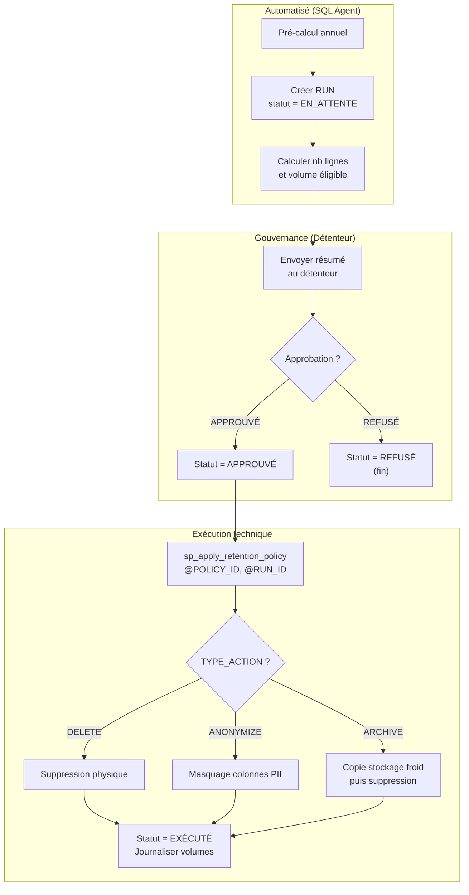

# 08 - Rétention et Cycle de Vie des Données

**Régie du Bâtiment du Québec (RBQ)**  
**Projet RIPQUAR**  
**Version 1.0 – Mars 2026**  
**Auteur : Eliot Alanmanou, Architecte de données**

---

## 1. Objectif

Définir le mécanisme générique de rétention des données dans l'entrepôt RIPQUAR, conforme à la Loi 25. Ce document sert de spécification pour :

- Le **tableau de bord (TBD) Power BI** de suivi de la rétention
- Le **modèle de données de gouvernance** (tables `GOV_*`)
- Les **règles de gestion** encadrant la suppression, l'anonymisation et l'archivage

---

## 2. Règles de gestion

| ID | Catégorie | Règle | Détail | Référence |
|----|-----------|-------|--------|-----------|
| RG-RET-01 | Durée de rétention | Rétention cible de 7 ans pour les données de l'entrepôt | Toute donnée dont la date de référence (colonne temporelle) dépasse 7 ans est éligible à la purge, l'anonymisation ou l'archivage. | Loi 25 |
| RG-RET-02 | Processus de suppression | Suppression annuelle uniquement, avec approbation explicite du détenteur | La purge s'effectue dans une fenêtre annuelle planifiée. Le détenteur reçoit un résumé (volume, tables, période) et doit approuver formellement avant toute exécution. | Politique interne RBQ |
| RG-RET-03 | Processus de suppression | Aucune suppression automatique sans approbation | Le pré-calcul est automatisé (job SQL Agent), mais l'exécution de la purge est bloquée tant que le statut du run n'est pas APPROUVÉ par le détenteur. | Politique interne RBQ |
| RG-RET-04 | Réutilisabilité | Mécanisme générique réutilisable pour tout domaine | Pour ajouter un nouveau périmètre, il suffit d'ajouter une ligne dans `GOV_DATA_RETENTION_POLICY` avec la table, la clé temporelle, la durée et le détenteur. Le même workflow s'applique. | Architecture RIPQUAR |
| RG-RET-05 | Types d'action | Trois types d'action : DELETE, ANONYMIZE, ARCHIVE | DELETE = suppression physique. ANONYMIZE = remplacement des colonnes PII par des valeurs masquées. ARCHIVE = copie vers stockage froid puis suppression du DWH. | Architecture RIPQUAR |
| RG-RET-06 | Audit | Chaque exécution est journalisée dans `GOV_DATA_RETENTION_RUN` | Le run contient : date demande, demandeur, date approbation, approbateur, nb lignes cible vs traitées, volume libéré, statut final et commentaire. Conservation illimitée des runs. | Loi 25 – Auditabilité |
| RG-RET-07 | Conformité Loi 25 | Données PII : rétention max 7 ans sauf obligation légale | Concerne : noms, prénoms, emails, PERSON_UID, numéros d'inscription. Le champ EMAIL est déjà haché (SHA256) dans DIM_CANDIDAT. Les libellés de questions/choix ne sont pas stockés (masquage à la source). | Loi 25 + ADR-RIP-005 |
| RG-RET-08 | Historisation SCD2 | Les versions SCD2 expirées sont soumises à la rétention | Les lignes avec `SCD_IS_CURRENT = 0` et `SCD_VALID_TO` antérieur à 7 ans sont éligibles. Les versions courantes ne sont jamais purgées. | Architecture DWH RIPQUAR |
| RG-RET-09 | Périmètre initial | Phase 1 : schémas RIPQUAR_STG et RIPQUAR_DWH | Phase 2 : extension aux tables [dbo] répliquées et logs ETL. Phase 3 : extension à d'autres systèmes (InfoGestion, etc.). | Feuille de route RBQ |
| RG-RET-10 | Tableau de bord | Le TBD est accessible aux détenteurs et à l'architecte | Rapport Power BI avec 3 sections. Rafraîchissement mensuel. Le détenteur peut consulter les données éligibles avant d'approuver. | Ce document |

---

## 3. Workflow de rétention



---

## 4. Modèle de données de gouvernance

### 4.1. GOV_DATA_RETENTION_POLICY

| Colonne | Type | Null | PK/FK | Description |
|---------|------|------|-------|-------------|
| POLICY_ID | INT IDENTITY | N | PK | Identifiant unique de la politique de rétention |
| SYSTEME | VARCHAR(50) | N | | Système source (RIPQUAR, InfoGestion, GIC, etc.) |
| SCHEMA_NOM | VARCHAR(50) | N | | Schéma SQL Server (dbo, RIPQUAR_STG, RIPQUAR_DWH) |
| TABLE_NOM | VARCHAR(128) | N | | Nom de la table ou vue logique ciblée |
| CLE_TEMPORELLE | VARCHAR(128) | N | | Colonne de référence temporelle (ex: SCD_VALID_TO, CREATED) |
| DUREE_RETENTION_ANNEES | INT | N | | Durée de rétention en années (ex: 7 pour Loi 25) |
| TYPE_ACTION | VARCHAR(20) | N | | Action à appliquer : DELETE, ANONYMIZE ou ARCHIVE |
| DETENTEUR_ID | VARCHAR(50) | N | | Identifiant du détenteur de l'information |
| DETENTEUR_NOM | VARCHAR(100) | N | | Nom complet du détenteur responsable de l'approbation |
| DETENTEUR_ROLE | VARCHAR(100) | Y | | Rôle / titre du détenteur (ex: Directeur DTI) |
| ACTIF_OUI_NON | CHAR(1) | N | | O = politique active, N = désactivée |
| DATE_CREATION | DATETIME | N | | Date de création de la politique |
| DATE_MODIFICATION | DATETIME | Y | | Date de dernière modification |
| COMMENTAIRE | NVARCHAR(500) | Y | | Notes ou justification |

### 4.2. GOV_DATA_RETENTION_RUN

| Colonne | Type | Null | PK/FK | Description |
|---------|------|------|-------|-------------|
| RUN_ID | INT IDENTITY | N | PK | Identifiant unique de la campagne de rétention |
| POLICY_ID | INT | N | FK → POLICY | Référence vers la politique de rétention |
| DATE_DEMANDE | DATETIME | N | | Date de génération automatique de la campagne |
| DEMANDEUR | VARCHAR(100) | N | | Système ou personne ayant déclenché le pré-calcul |
| DATE_APPROBATION | DATETIME | Y | | Date d'approbation par le détenteur (NULL si en attente) |
| APPROUVE_PAR | VARCHAR(100) | Y | | Nom du détenteur ayant approuvé |
| FENETRE_EXECUTION | VARCHAR(50) | Y | | Période autorisée (ex: 2026-Q1) |
| NB_LIGNES_CIBLE | BIGINT | Y | | Nb de lignes éligibles calculé lors du pré-calcul |
| NB_LIGNES_TRAITEES | BIGINT | Y | | Nb de lignes effectivement traitées |
| VOLUME_LIBERE_GO | DECIMAL(10,2) | Y | | Volume libéré en Go |
| STATUT | VARCHAR(20) | N | | EN_ATTENTE, APPROUVÉ, EXÉCUTÉ, REFUSÉ, ANNULÉ |
| DATE_EXEC | DATETIME | Y | | Date d'exécution effective |
| COMMENTAIRE | NVARCHAR(500) | Y | | Notes du détenteur ou du système |

### 4.3. RETENTION_FACT (vue matérialisée)

| Colonne | Type | Null | PK/FK | Description |
|---------|------|------|-------|-------------|
| FACT_ID | INT IDENTITY | N | PK | Identifiant technique |
| POLICY_ID | INT | N | FK → POLICY | Référence vers la politique |
| SYSTEME | VARCHAR(50) | N | | Système source (dénormalisé) |
| SCHEMA_NOM | VARCHAR(50) | N | | Schéma (dénormalisé) |
| TABLE_NOM | VARCHAR(128) | N | | Table (dénormalisé) |
| NB_LIGNES_TOTAL | BIGINT | N | | Nb total de lignes dans la table |
| NB_LIGNES_HORS_RETENTION | BIGINT | N | | Nb de lignes au-delà de la durée de rétention |
| NB_BYTES_TOTAL | BIGINT | Y | | Volume total en octets |
| NB_BYTES_HORS_RETENTION | BIGINT | Y | | Volume estimé des lignes hors rétention |
| DATE_CALCUL | DATETIME | N | | Date du dernier calcul |
| DATE_MIN | DATETIME | Y | | Date la plus ancienne dans la table |
| DATE_MAX | DATETIME | Y | | Date la plus récente dans la table |
| TRANCHE_AGE | VARCHAR(20) | Y | | Tranche d'ancienneté (0-3 ans, 3-5, 5-7, >7) |

---

## 5. Catalogue des KPIs – Tableau de bord Power BI

### 5.1. Risque et Conformité

| ID | Nom | Description | Formule (DAX/SQL) | Source | Visuel | Seuil d'alerte | Fréquence |
|----|-----|-------------|-------------------|--------|--------|----------------|-----------|
| RET-01 | % Données hors rétention | Pourcentage de lignes dont la date de référence dépasse la durée de rétention cible (7 ans). Indicateur principal de conformité Loi 25. Un seuil > 0 % signifie qu'une campagne de purge est requise. | `DIVIDE([Nb_Lignes_Hors_Retention], [Nb_Lignes_Total], 0) * 100` | RETENTION_FACT | Carte KPI (jauge) | Rouge > 5 % ; Jaune 1-5 % ; Vert 0 % | Mensuel |
| RET-02 | Volume libérable (Go) | Volume estimé (en Go) des données dépassant la rétention cible, potentiellement supprimables ou archivables après approbation du détenteur. | `DIVIDE(SUM(RETENTION_FACT[Nb_Bytes_Hors_Retention]), 1024*1024*1024, 0)` | RETENTION_FACT | Carte KPI | Information | Mensuel |
| RET-03 | Top 10 tables à risque | Classement des 10 jeux de données comportant le plus grand nombre de lignes au-delà de la durée de rétention. Permet de cibler la prochaine campagne annuelle de purge. | `TOPN(10, ALL(RETENTION_FACT), [Nb_Lignes_Hors_Retention], DESC)` | RETENTION_FACT, GOV_DATA_RETENTION_POLICY | Matrix triée | Rouge si lignes > 100 000 | Mensuel |
| RET-04 | Distribution ancienneté données | Répartition du volume de données par tranche d'ancienneté : 0-3 ans, 3-5 ans, 5-7 ans, > 7 ans. Permet de visualiser la courbe de vieillissement et anticiper les purges futures. | `SWITCH(TRUE(), DATEDIFF(Date_Ref, TODAY(), YEAR) <= 3, "0-3 ans", ...)` | RETENTION_FACT | Histogramme empilé | Rouge sur tranche > 7 ans | Mensuel |
| RET-05 | Indicateur global conformité | Indicateur binaire : CONFORME si aucune donnée au-delà de la rétention cible n'est présente sans campagne approuvée en cours. NON CONFORME sinon. | `IF([Nb_Lignes_Hors_Retention] = 0 \|\| [Nb_Policies_Approuvees] > 0, "CONFORME", "NON CONFORME")` | RETENTION_FACT, GOV_DATA_RETENTION_RUN | Pastille verte/rouge | Rouge = NON CONFORME | Mensuel |

### 5.2. Volume et Impact

| ID | Nom | Description | Formule (DAX/SQL) | Source | Visuel | Seuil d'alerte | Fréquence |
|----|-----|-------------|-------------------|--------|--------|----------------|-----------|
| RET-06 | Nb lignes éligibles par domaine | Nombre total de lignes éligibles à la purge, ventilé par système / domaine métier. Permet au détenteur d'évaluer l'ampleur avant approbation. | `CALCULATE(SUM(RETENTION_FACT[Nb_Lignes]), Date_Ref < EDATE(TODAY(), -12 * POLICY[Duree]))` | RETENTION_FACT, POLICY | Bar chart horizontal | Information | Annuel |
| RET-07 | Nb rapports Power BI impactés | Nombre de rapports Power BI qui consomment les tables ciblées par une policy de rétention. Aide à évaluer l'impact métier d'une purge. | `DISTINCTCOUNT(IMPACT_RAPPORT[Rapport_ID])` | POLICY, IMPACT_RAPPORT | Carte KPI + tooltip | Information | Annuel |
| RET-08 | Volume libéré cumulatif (Go/an) | Courbe chronologique du volume (Go) effectivement libéré après chaque campagne exécutée. Permet de suivre l'efficacité du mécanisme dans le temps. | `CALCULATE(SUM(RUN[Volume_Libere_Go]), RUN[Statut] = "EXECUTE")` | GOV_DATA_RETENTION_RUN | Courbe cumulative | Information | Post-campagne |

### 5.3. Gouvernance et Approbations

| ID | Nom | Description | Formule (DAX/SQL) | Source | Visuel | Seuil d'alerte | Fréquence |
|----|-----|-------------|-------------------|--------|--------|----------------|-----------|
| RET-09 | Nb policies en attente approbation | Nombre de campagnes de rétention (runs) en attente d'approbation par le détenteur. Rappel : aucune suppression sans approbation explicite. | `CALCULATE(DISTINCTCOUNT(RUN[RUN_ID]), RUN[Statut] = "EN_ATTENTE")` | GOV_DATA_RETENTION_RUN | Carte KPI | Jaune > 0 ; Rouge > 3 | Hebdomadaire |
| RET-10 | Délai moyen approbation (jours) | Nombre moyen de jours entre la date de proposition d'une campagne et la date d'approbation par le détenteur. Mesure la réactivité de la gouvernance. | `AVERAGE(DATEDIFF(RUN[Date_Demande], RUN[Date_Approbation], DAY))` | GOV_DATA_RETENTION_RUN | Carte KPI | Rouge > 60j ; Jaune > 30j | Post-campagne |
| RET-11 | Nb runs exécutés cette année | Nombre de campagnes de purge effectivement exécutées durant l'année fiscale en cours. Attendu : 1 par an (fenêtre annuelle). | `CALCULATE(COUNTROWS(RUN), RUN[Statut] = "EXECUTE", YEAR(RUN[Date_Exec]) = YEAR(TODAY()))` | GOV_DATA_RETENTION_RUN | Carte KPI | Vert = 1 ; Rouge = 0 | Annuel |
| RET-12 | Vue par détenteur | Tableau croisé par détenteur montrant : nb de policies assignées, nb de runs en attente, nb de runs exécutés, dernier run exécuté. Responsabilise chaque détenteur. | `GROUP BY Detenteur : COUNT(POLICY), COUNTIF(Statut='EN_ATTENTE'), ...` | POLICY, RUN | Matrix | Rouge si runs en attente > 0 | Annuel |

---

## 6. Layout du tableau de bord Power BI

```
┌─────────────────────────────────────────────────────────────────────────┐
│  BANDEAU HAUT – KPIs SYNTHÈSE                                          │
│  ┌──────────┐ ┌──────────┐ ┌──────────┐ ┌──────────┐ ┌──────────┐     │
│  │ RET-01   │ │ RET-02   │ │ RET-05   │ │ RET-09   │ │ RET-11   │     │
│  │ % hors   │ │ Volume   │ │ Conforme │ │ En       │ │ Runs     │     │
│  │ rétention│ │ libérable│ │ / Non    │ │ attente  │ │ exécutés │     │
│  └──────────┘ └──────────┘ └──────────┘ └──────────┘ └──────────┘     │
├─────────────────────────────────┬───────────────────────────────────────┤
│  RISQUE & CONFORMITÉ            │  GOUVERNANCE & APPROBATIONS           │
│                                 │                                       │
│  RET-04 Histogramme ancienneté  │  RET-12 Matrix par détenteur          │
│  ┌─────────────────────────┐    │  ┌─────────────────────────────┐      │
│  │ ████ 0-3               │    │  │ Détenteur | Policies | Att. │      │
│  │ ███  3-5               │    │  │ Dir. DTI  |    3     |  1   │      │
│  │ ██   5-7               │    │  │ Dir. QA   |    2     |  0   │      │
│  │ █    >7  ← ROUGE       │    │  └─────────────────────────────┘      │
│  └─────────────────────────┘    │                                       │
│                                 │  RET-10 Délai moyen approbation       │
│  RET-03 Top 10 tables à risque │  RET-08 Courbe volume libéré          │
│  ┌─────────────────────────┐    │  ┌─────────────────────────────┐      │
│  │ Table     | Lignes | Go │    │  │ ──────────/                 │      │
│  │ FACT_RES  | 50K    | 2  │    │  │          /                  │      │
│  │ DIM_CAND  | 30K    | 1  │    │  │    ─────/                   │      │
│  └─────────────────────────┘    │  │ 2024  2025  2026            │      │
│                                 │  └─────────────────────────────┘      │
│  RET-06 Lignes par domaine      │                                       │
└─────────────────────────────────┴───────────────────────────────────────┘
```

---

## 7. Réutilisation pour d'autres domaines

Pour ajouter un nouveau périmètre de rétention (ex: dossiers disciplinaires, logs applicatifs), insérer une ligne :

```sql
INSERT INTO GOV_DATA_RETENTION_POLICY (
    SYSTEME, SCHEMA_NOM, TABLE_NOM, CLE_TEMPORELLE,
    DUREE_RETENTION_ANNEES, TYPE_ACTION,
    DETENTEUR_ID, DETENTEUR_NOM, DETENTEUR_ROLE,
    ACTIF_OUI_NON, DATE_CREATION
) VALUES (
    'NOUVEAU_SYSTEME', 'dbo', 'MA_TABLE', 'DATE_CREATION',
    7, 'ARCHIVE',
    'DET-001', 'Jean Dupont', 'Directeur TI',
    'O', GETDATE()
);
```

Le même workflow (pré-calcul automatique, approbation détenteur, exécution technique, journalisation) s'applique sans modification de code.

---

*Document généré – RIPQUAR RBQ Mars 2026*
