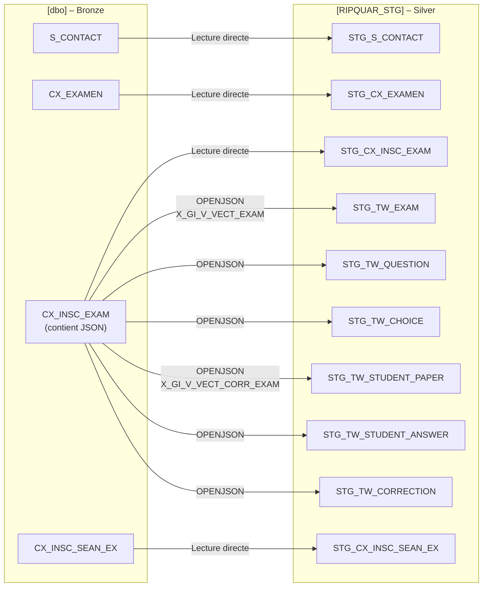

# 09 - Mapping [dbo] vers [RIPQUAR_STG] – Attribut par Attribut

**Régie du Bâtiment du Québec (RBQ)**  
**Projet RIPQUAR**  
**Version 1.0 – Mars 2026**  
**Auteur : Eliot Alanmanou, Architecte de données**

---

## 1. Objectif

Documenter le mapping **attribut par attribut** entre les tables source `[dbo]` (Bronze) et les tables staging `[RIPQUAR_STG]` (Silver). Ce document comble le gap identifié par l'équipe : le tronçon dbo → STG n'était documenté qu'au niveau table/chemin JSON.

Le mapping STG → DWH existe déjà dans `ripquar_dictionnaire_mapping_stg_fact_v1.md`.

---

## 2. Vue d'ensemble des flux

**Légende des transformations :**
- **DIRECT** : copie 1:1 de la colonne source
- **OPENJSON** : parsing JSON avec `OPENJSON` / `CROSS APPLY`
- **CAST** : conversion de type (ex: INT → DECIMAL)
- **CONSTANTE** : valeur fixe injectée par l'ETL
- **HASHBYTES** : calcul SHA256 pour détection delta

---

## 3. Famille A – Tables Siebel (Lecture directe)

### 3.1. [dbo].S_CONTACT → [RIPQUAR_STG].STG_S_CONTACT

| Colonne Source [dbo] | Colonne Cible STG | Type Source | Type Cible | Transformation | Null | Commentaire |
|----------------------|-------------------|-------------|------------|----------------|------|-------------|
| ROW_ID | ROW_ID | VARCHAR(15) | VARCHAR(15) | DIRECT | N | PK Siebel |
| PERSON_UID | PERSON_UID | VARCHAR(30) | VARCHAR(20) | DIRECT | Y | Lien vers TestWe studentNumber (informatif) |
| FST_NAME | FST_NAME | VARCHAR(50) | VARCHAR(100) | DIRECT | Y | Prénom candidat |
| LAST_NAME | LAST_NAME | VARCHAR(50) | VARCHAR(100) | DIRECT | Y | Nom candidat |
| EMAIL_ADDR | EMAIL_ADDR | VARCHAR(100) | VARCHAR(255) | DIRECT | Y | SENSIBLE Loi 25 |
| CREATED | CREATED | DATETIME2 | DATETIME | DIRECT | Y | Date création Siebel |
| LAST_UPD | LAST_UPD | DATETIME2 | DATETIME | DIRECT | Y | Dernière modification |
| *(Technique)* | ETL_LOAD_DATE | | DATETIME | GETDATE() | N | Horodatage chargement ETL |
| *(Technique)* | ETL_SOURCE_SYSTEM | | VARCHAR(20) | CONSTANTE='SIEBEL' | N | Identifiant source |
| *(Technique)* | ETL_BATCH_ID | | VARCHAR(50) | VARIABLE_SSIS | Y | ID batch SSIS |
| *(Technique)* | ETL_ROW_HASH | | VARCHAR(64) | HASHBYTES('SHA2_256') | Y | SHA256 détection delta |

---

## 4. Famille B – Tables GIC (Lecture directe)

### 4.1. [dbo].CX_EXAMEN → [RIPQUAR_STG].STG_CX_EXAMEN

| Colonne Source [dbo] | Colonne Cible STG | Type Source | Type Cible | Transformation | Null | Commentaire |
|----------------------|-------------------|-------------|------------|----------------|------|-------------|
| CX_EXAMEN_ROW_ID | ROW_ID | VARCHAR(15) | VARCHAR(15) | DIRECT | N | PK Siebel examen |
| X_GI_C_EXAM | X_GI_C_EXAM | VARCHAR(50) | VARCHAR(50) | DIRECT | N | Code examen unique (ADM-20000-021) |
| NAME | NAME | VARCHAR(255) | VARCHAR(255) | DIRECT | Y | Libellé de l'examen |
| X_GI_C_LANG_EXAM | X_GI_C_LANG | VARCHAR(2) | VARCHAR(10) | DIRECT | Y | Code langue (F/A) |
| X_GI_N_DURE_EXAM | X_GI_NB_DURE_EXAM | INT | INT | DIRECT | Y | Durée allouée (minutes) |
| X_GI_N_SEUI_REUS_EXAM | X_GI_V_NOTE_PASS | INT | DECIMAL(5,2) | CAST(INT→DECIMAL) | Y | Seuil de passage (%) |
| X_GI_N_NB_QUES_EXAM | X_GI_NB_QUES | INT | INT | DIRECT | Y | Nb questions |
| X_GI_I_ACTF_EXAM | ACTIVE_FLG | CHAR(1) | CHAR(1) | DIRECT | Y | Indicateur actif (Y/N) |
| *(à identifier)* | X_GI_IND_CIRC | | CHAR(1) | DIRECT | Y | En circulation – source dbo à confirmer |
| *(à identifier)* | X_GI_C_SOUS_CAT | | VARCHAR(50) | DIRECT | Y | Sous-catégorie – source dbo à confirmer |
| CREATED | CREATED | DATETIME2 | DATETIME | DIRECT | Y | Date création |
| LAST_UPD | LAST_UPD | DATETIME2 | DATETIME | DIRECT | Y | Dernière modification |
| *(Technique)* | ETL_LOAD_DATE | | DATETIME | GETDATE() | N | Horodatage ETL |
| *(Technique)* | ETL_SOURCE_SYSTEM | | VARCHAR(20) | CONSTANTE='GIC' | N | Source |
| *(Technique)* | ETL_BATCH_ID | | VARCHAR(50) | VARIABLE_SSIS | Y | ID batch |
| *(Technique)* | ETL_ROW_HASH | | VARCHAR(64) | HASHBYTES('SHA2_256') | Y | SHA256 delta |

### 4.2. [dbo].CX_INSC_EXAM → [RIPQUAR_STG].STG_CX_INSC_EXAM

| Colonne Source [dbo] | Colonne Cible STG | Type Source | Type Cible | Transformation | Null | Commentaire |
|----------------------|-------------------|-------------|------------|----------------|------|-------------|
| CX_INSC_EXAM_ROW_ID | ROW_ID | VARCHAR(15) | VARCHAR(15) | DIRECT | N | PK inscription |
| PAR_ROW_ID__CX_EXAMEN | PAR_ROW_ID__CXEXAMEN | VARCHAR(15) | VARCHAR(15) | DIRECT | N | FK → CX_EXAMEN |
| PAR_ROW_ID__S_CONTACT | PAR_ROW_ID__SCONTACT | VARCHAR(15) | VARCHAR(15) | DIRECT | N | FK → S_CONTACT |
| PAR_ROW_ID__SSRV_REQ | PAR_ROW_ID__SSRV_REQ | VARCHAR(15) | VARCHAR(15) | DIRECT | Y | FK → S_SRV_REQ |
| X_GI_I_REPR_EXAM | X_GI_I_REPR_EXAM | CHAR(1) | INT | CAST(CHAR→INT) | Y | Numéro tentative |
| X_GI_V_NOTE_INIT_EXAM | X_GI_V_NOTE_INIT_EXAM | DECIMAL(5,2) | DECIMAL(5,2) | DIRECT | Y | Note initiale (%) |
| X_GI_V_NOTE_REVS_EXAM | X_GI_V_NOTE_REVS_EXAM | DECIMAL(5,2) | DECIMAL(5,2) | DIRECT | Y | Note révisée |
| X_GI_D_ANNL_INSC_EXAM | X_GI_D_ANNL_INSC_EXAM | DATETIME2 | DATETIME | DIRECT | Y | Date annulation |
| X_GI_D_CORR_EXAM | X_GI_D_CORR_EXAM | DATETIME2 | DATETIME | DIRECT | Y | Date correction |
| X_GI_NO_VERS_EXAM | X_GI_NO_VERS_EXAM | VARCHAR(20) | VARCHAR(10) | DIRECT | Y | Version examen |
| X_GI_V_VECT_EXAM | X_GI_V_VECT_EXAM | NVARCHAR(MAX) | NVARCHAR(MAX) | DIRECT | Y | JSON brut examen TestWe – source parsing STG_TW_* |
| X_GI_V_VECT_REPN_CAND_EXAM | X_GI_V_VECT_REPN_CAND_EXAM | NVARCHAR(MAX) | NVARCHAR(MAX) | DIRECT | Y | JSON réponses candidat |
| X_GI_V_VECT_CORR_EXAM | X_GI_V_VECT_CORR_EXAM | NVARCHAR(MAX) | NVARCHAR(MAX) | DIRECT | Y | JSON corrections TestWe – source parsing STG_TW_* |
| CREATED | CREATED | DATETIME2 | DATETIME | DIRECT | Y | Date création |
| LAST_UPD | LAST_UPD | DATETIME2 | DATETIME | DIRECT | Y | Dernière modification |
| DB_LAST_UPD | DB_LAST_UPD | DATETIME2 | DATETIME | DIRECT | Y | Timestamp BD |
| *(Technique)* | ETL_LOAD_DATE | | DATETIME | GETDATE() | N | Horodatage ETL |
| *(Technique)* | ETL_SOURCE_SYSTEM | | VARCHAR(20) | CONSTANTE='GIC' | N | Source |
| *(Technique)* | ETL_BATCH_ID | | VARCHAR(50) | VARIABLE_SSIS | Y | ID batch |
| *(Technique)* | ETL_ROW_HASH | | VARCHAR(64) | HASHBYTES('SHA2_256') | Y | SHA256 delta |

### 4.3. [dbo].CX_INSC_SEAN_EX → [RIPQUAR_STG].STG_CX_INSC_SEAN_EX

| Colonne Source [dbo] | Colonne Cible STG | Type Source | Type Cible | Transformation | Null | Commentaire |
|----------------------|-------------------|-------------|------------|----------------|------|-------------|
| CX_INSC_SEAN_EX_ROW_ID | ROW_ID | VARCHAR(15) | VARCHAR(15) | DIRECT | N | PK inscription séance |
| PAR_ROW_ID__CX_INSC_EXAM | PAR_ROW_ID__CXINSCEXAM | VARCHAR(15) | VARCHAR(15) | DIRECT | N | FK → CX_INSC_EXAM |
| PAR_ROW_ID__CX_SEANCE_EXAM | PAR_ROW_ID__CXSEANCEEXAM | VARCHAR(15) | VARCHAR(15) | DIRECT | N | FK → CX_SEANCE_EXAM |
| X_GI_C_EXAM_TW | X_GI_C_EXAM_TW | VARCHAR(100) | VARCHAR(100) | DIRECT | Y | **CLÉ PIVOT** vers TestWe (ex: ADM-20000-100-F-166) |
| X_GI_C_STAT_INTG_EXAM_TW | X_GI_C_STAT_INSC | VARCHAR(50) | VARCHAR(30) | DIRECT | Y | Statut intégration TestWe |
| X_GI_I_PRES | X_GI_IND_ABSE | CHAR(1) | CHAR(1) | INVERSION (Y→N, N→Y) | Y | Présence inversée en absence |
| *(via CX_SEANCE_EXAM)* | X_GI_D_CONV | | DATETIME | JOINTURE | Y | Date convocation – via séance |
| CREATED | CREATED | DATETIME2 | DATETIME | DIRECT | Y | Date création |
| LAST_UPD | LAST_UPD | DATETIME2 | DATETIME | DIRECT | Y | Dernière modification |
| *(Technique)* | ETL_LOAD_DATE | | DATETIME | GETDATE() | N | Horodatage ETL |
| *(Technique)* | ETL_SOURCE_SYSTEM | | VARCHAR(20) | CONSTANTE='GIC' | N | Source |
| *(Technique)* | ETL_BATCH_ID | | VARCHAR(50) | VARIABLE_SSIS | Y | ID batch |
| *(Technique)* | ETL_ROW_HASH | | VARCHAR(64) | HASHBYTES('SHA2_256') | Y | SHA256 delta |

---

## 5. Famille C – Tables TestWe (Parsing JSON via OPENJSON)

> **Source physique commune :** `[dbo].CX_INSC_EXAM` colonnes `X_GI_V_VECT_EXAM` et `X_GI_V_VECT_CORR_EXAM` (NVARCHAR(MAX) contenant le JSON TestWe complet).

### 5.1. X_GI_V_VECT_EXAM → [RIPQUAR_STG].STG_TW_EXAM

| Chemin JSON | Colonne Cible STG | Type Cible | Transformation | Null | Commentaire |
|-------------|-------------------|------------|----------------|------|-------------|
| `$.exam.@id` | ID | VARCHAR(36) | OPENJSON | N | UUID examen TestWe |
| `$.exam.name` | NAME | VARCHAR(255) | OPENJSON | N | **CLÉ PIVOT** = X_GI_C_EXAM_TW |
| `$.exam.duration` | DURATION | INT | OPENJSON + CAST(→INT) | Y | Durée en secondes |
| `$.exam.maxPoints` | MAX_POINTS | INT | OPENJSON + CAST(→INT) | Y | Points maximum |
| `$.exam.startDate` | START_DATE | DATETIME | OPENJSON + CAST(→DATETIME) | Y | Date début disponibilité |
| `$.exam.status` | STATUS | VARCHAR(20) | OPENJSON | Y | Statut (in_creation, finalized, archived) |
| `$.exam.nbStudents` | NB_STUDENTS | INT | OPENJSON + CAST(→INT) | Y | Nb candidats inscrits |
| `$.exam.nbCopiesCorrected` | NB_COPIES_CORRECTED | INT | OPENJSON + CAST(→INT) | Y | Nb copies corrigées |
| `$.exam.averageGrade` | AVERAGE_GRADE | DECIMAL(5,2) | OPENJSON + CAST(→DECIMAL) | Y | Note moyenne (94d) |
| `$.exam.randomQuestions` | IS_RANDOM_QUESTIONS | BIT | OPENJSON + CAST(→BIT) | Y | Ordre aléatoire questions |
| `$.exam.randomChoices` | IS_RANDOM_CHOICES | BIT | OPENJSON + CAST(→BIT) | Y | Ordre aléatoire choix |
| `$.exam.createdAt` | CREATED_AT | DATETIME | OPENJSON + CAST(→DATETIME) | Y | Date création TestWe |
| `$.exam.updatedAt` | UPDATED_AT | DATETIME | OPENJSON + CAST(→DATETIME) | Y | Date modification TestWe |
| *(Technique)* | ETL_LOAD_DATE | DATETIME | GETDATE() | N | Horodatage ETL |
| *(Technique)* | ETL_SOURCE_SYSTEM | VARCHAR(20) | CONSTANTE='TESTWE' | N | Source |
| *(Technique)* | ETL_BATCH_ID | VARCHAR(50) | VARIABLE_SSIS | Y | ID batch |
| *(Technique)* | ETL_ROW_HASH | VARCHAR(64) | HASHBYTES('SHA2_256') | Y | SHA256 delta |

### 5.2. X_GI_V_VECT_EXAM → [RIPQUAR_STG].STG_TW_QUESTION

| Chemin JSON | Colonne Cible STG | Type Cible | Transformation | Null | Commentaire |
|-------------|-------------------|------------|----------------|------|-------------|
| `$.exam.questions[*].@id` | ID | VARCHAR(36) | OPENJSON CROSS APPLY | N | UUID instance question |
| `$.exam.questions[*].questionBank.id` | QUESTION_BANK_ID | VARCHAR(36) | OPENJSON CROSS APPLY | Y | ID banque (clé stable versioning) |
| `$.exam.questions[*].externalReference` | EXTERNAL_REFERENCE | VARCHAR(50) | OPENJSON CROSS APPLY | Y | **LIEN GIC** (Q20000-00001-F) → CX_QUEST_EXAM.X_GI_C_QUES |
| `$.exam.questions[*].position` | POSITION | INT | OPENJSON + CAST(→INT) | Y | Position dans l'examen |
| `$.exam.questions[*].numberPoint` | NUMBER_POINT | INT | OPENJSON + CAST(→INT) | Y | Points attribués (1 pour QCM) |
| `$.exam.questions[*].type` | TYPE | VARCHAR(50) | OPENJSON CROSS APPLY | Y | Type (single_choice_question) |
| `$.exam.questions[*].randomChoices` | RANDOM_CHOICES | BIT | OPENJSON + CAST(→BIT) | Y | Randomisation choix |
| `$.exam.questions[*].createdAt` | CREATED_AT | DATETIME | OPENJSON + CAST(→DATETIME) | Y | Date création |
| `$.exam.questions[*].updatedAt` | UPDATED_AT | DATETIME | OPENJSON + CAST(→DATETIME) | Y | Date modification |
| *(Technique)* | ETL_LOAD_DATE | DATETIME | GETDATE() | N | Horodatage ETL |
| *(Technique)* | ETL_SOURCE_SYSTEM | VARCHAR(20) | CONSTANTE='TESTWE' | N | Source |
| *(Technique)* | ETL_BATCH_ID | VARCHAR(50) | VARIABLE_SSIS | Y | ID batch |
| *(Technique)* | ETL_ROW_HASH | VARCHAR(64) | HASHBYTES('SHA2_256') | Y | SHA256 delta |

### 5.3. X_GI_V_VECT_EXAM → [RIPQUAR_STG].STG_TW_CHOICE

| Chemin JSON | Colonne Cible STG | Type Cible | Transformation | Null | Commentaire |
|-------------|-------------------|------------|----------------|------|-------------|
| `$.exam.questions[*].choices[*].@id` | ID | VARCHAR(36) | OPENJSON CROSS APPLY x2 | N | UUID choix |
| `$.exam.questions[*].choices[*].question` | FK_QUESTION_ID | VARCHAR(36) | OPENJSON CROSS APPLY x2 | N | FK vers STG_TW_QUESTION |
| `$.exam.questions[*].choices[*].name` | NAME | NVARCHAR(MAX) | OPENJSON CROSS APPLY x2 | Y | Texte du choix – SENSIBLE Loi 25 |
| `$.exam.questions[*].choices[*].correct` | CORRECT | BIT | OPENJSON + CAST(→BIT) | Y | Bonne réponse – SENSIBLE Loi 25 |
| `$.exam.questions[*].choices[*].position` | POSITION | INT | OPENJSON + CAST(→INT) | Y | Position (0=A, 1=B, 2=C, 3=D) |
| *(Technique)* | ETL_LOAD_DATE | DATETIME | GETDATE() | N | Horodatage ETL |
| *(Technique)* | ETL_SOURCE_SYSTEM | VARCHAR(20) | CONSTANTE='TESTWE' | N | Source |
| *(Technique)* | ETL_BATCH_ID | VARCHAR(50) | VARIABLE_SSIS | Y | ID batch |
| *(Technique)* | ETL_ROW_HASH | VARCHAR(64) | HASHBYTES('SHA2_256') | Y | SHA256 delta |

### 5.4. X_GI_V_VECT_CORR_EXAM → [RIPQUAR_STG].STG_TW_STUDENT_PAPER

| Chemin JSON | Colonne Cible STG | Type Cible | Transformation | Null | Commentaire |
|-------------|-------------------|------------|----------------|------|-------------|
| `$.studentPaper.@id` | ID | VARCHAR(36) | OPENJSON | N | UUID copie candidat |
| `$.studentPaper.exam` | FK_EXAM_ID | VARCHAR(36) | OPENJSON (extraction UUID) | N | FK vers STG_TW_EXAM |
| `$.studentPaper.student` | FK_USER_ID | VARCHAR(36) | OPENJSON (extraction UUID) | N | FK vers STG_TW_USER |
| `$.studentPaper.startDate` | START_DATE | DATETIME | OPENJSON + CAST(→DATETIME) | Y | Début passation |
| `$.studentPaper.endDate` | END_DATE | DATETIME | OPENJSON + CAST(→DATETIME) | Y | Fin passation |
| `$.studentPaper.submitDate` | SUBMIT_DATE | DATETIME | OPENJSON + CAST(→DATETIME) | Y | Date soumission |
| `$.studentPaper.gradingDate` | GRADING_DATE | DATETIME | OPENJSON + CAST(→DATETIME) | Y | Date correction auto |
| `$.studentPaper.totalPoints` | TOTAL_POINTS | INT | OPENJSON + CAST(→INT) | Y | Score obtenu (94d) |
| `$.studentPaper.maxPoints` | MAX_POINTS | INT | OPENJSON + CAST(→INT) | Y | Score max (KR-20) |
| `$.studentPaper.status` | STATUS | VARCHAR(20) | OPENJSON | Y | Statut copie (corrected, finalized) |
| `$.studentPaper.createdAt` | CREATED_AT | DATETIME | OPENJSON + CAST(→DATETIME) | Y | Date création TestWe |
| `$.studentPaper.updatedAt` | UPDATED_AT | DATETIME | OPENJSON + CAST(→DATETIME) | Y | Date modification TestWe |
| *(Technique)* | ETL_LOAD_DATE | DATETIME | GETDATE() | N | Horodatage ETL |
| *(Technique)* | ETL_SOURCE_SYSTEM | VARCHAR(20) | CONSTANTE='TESTWE' | N | Source |
| *(Technique)* | ETL_BATCH_ID | VARCHAR(50) | VARIABLE_SSIS | Y | ID batch |
| *(Technique)* | ETL_ROW_HASH | VARCHAR(64) | HASHBYTES('SHA2_256') | Y | SHA256 delta |

### 5.5. X_GI_V_VECT_CORR_EXAM → [RIPQUAR_STG].STG_TW_STUDENT_ANSWER

| Chemin JSON | Colonne Cible STG | Type Cible | Transformation | Null | Commentaire |
|-------------|-------------------|------------|----------------|------|-------------|
| `$.studentAnswers[*].@id` | ID | VARCHAR(255) | OPENJSON CROSS APPLY | N | URI réponse candidat |
| `$.studentAnswers[*].studentPaper` | FK_STUDENT_PAPER_ID | VARCHAR(36) | OPENJSON (extraction UUID) | N | FK vers STG_TW_STUDENT_PAPER |
| `$.studentAnswers[*].question` | FK_QUESTION_URI | VARCHAR(255) | OPENJSON CROSS APPLY | Y | URI question (/v1/questions/...) |
| `$.studentAnswers[*].givenChoices` | GIVEN_CHOICES_JSON | NVARCHAR(MAX) | OPENJSON (array JSON) | Y | Array URIs choix sélectionnés |
| *(Technique)* | ETL_LOAD_DATE | DATETIME | GETDATE() | N | Horodatage ETL |
| *(Technique)* | ETL_SOURCE_SYSTEM | VARCHAR(20) | CONSTANTE='TESTWE' | N | Source |
| *(Technique)* | ETL_BATCH_ID | VARCHAR(50) | VARIABLE_SSIS | Y | ID batch |
| *(Technique)* | ETL_ROW_HASH | VARCHAR(64) | HASHBYTES('SHA2_256') | Y | SHA256 delta |

### 5.6. X_GI_V_VECT_CORR_EXAM → [RIPQUAR_STG].STG_TW_CORRECTION

| Chemin JSON | Colonne Cible STG | Type Cible | Transformation | Null | Commentaire |
|-------------|-------------------|------------|----------------|------|-------------|
| `$.studentAnswers[*].correction.@id` | ID | VARCHAR(36) | OPENJSON CROSS APPLY | N | UUID correction |
| `$.studentAnswers[*].correction.studentAnswer` | FK_ANSWER_ID | VARCHAR(255) | OPENJSON CROSS APPLY | N | FK vers STG_TW_STUDENT_ANSWER |
| `$.studentAnswers[*].correction.score` | NOTE | DECIMAL(3,1) | OPENJSON + CAST(→DECIMAL) | Y | Points obtenus (0 ou 1 pour QCM) |
| `$.studentAnswers[*].correction.isFlagged` | IS_FLAGGED | BIT | OPENJSON + CAST(→BIT) | Y | Question signalée pour révision |
| `$.studentAnswers[*].correction.updatedAt` | UPDATED_AT | DATETIME | OPENJSON + CAST(→DATETIME) | Y | Date modification |
| *(Technique)* | ETL_LOAD_DATE | DATETIME | GETDATE() | N | Horodatage ETL |
| *(Technique)* | ETL_SOURCE_SYSTEM | VARCHAR(20) | CONSTANTE='TESTWE' | N | Source |
| *(Technique)* | ETL_BATCH_ID | VARCHAR(50) | VARIABLE_SSIS | Y | ID batch |
| *(Technique)* | ETL_ROW_HASH | VARCHAR(64) | HASHBYTES('SHA2_256') | Y | SHA256 delta |

---

## 6. Synthèse de couverture

| Famille | Table Source [dbo] | Table Cible STG | Nb attributs mappés | Transformation |
|---------|-------------------|-----------------|---------------------|----------------|
| A. Siebel | S_CONTACT | STG_S_CONTACT | 11 | Lecture directe |
| B. GIC | CX_EXAMEN | STG_CX_EXAMEN | 16 | Lecture directe |
| B. GIC | CX_INSC_EXAM | STG_CX_INSC_EXAM | 20 | Lecture directe |
| B. GIC | CX_INSC_SEAN_EX | STG_CX_INSC_SEAN_EX | 13 | Lecture directe |
| C. TestWe JSON | CX_INSC_EXAM.X_GI_V_VECT_EXAM | STG_TW_EXAM | 17 | OPENJSON |
| C. TestWe JSON | CX_INSC_EXAM.X_GI_V_VECT_EXAM | STG_TW_QUESTION | 13 | OPENJSON CROSS APPLY |
| C. TestWe JSON | CX_INSC_EXAM.X_GI_V_VECT_EXAM | STG_TW_CHOICE | 9 | OPENJSON CROSS APPLY x2 |
| C. TestWe JSON | CX_INSC_EXAM.X_GI_V_VECT_CORR_EXAM | STG_TW_STUDENT_PAPER | 16 | OPENJSON |
| C. TestWe JSON | CX_INSC_EXAM.X_GI_V_VECT_CORR_EXAM | STG_TW_STUDENT_ANSWER | 8 | OPENJSON CROSS APPLY |
| C. TestWe JSON | CX_INSC_EXAM.X_GI_V_VECT_CORR_EXAM | STG_TW_CORRECTION | 9 | OPENJSON CROSS APPLY |
| | | **TOTAL** | **132** | |

---

## 7. Points à confirmer

| # | Question | Impact |
|---|----------|--------|
| 1 | Source exacte de `X_GI_IND_CIRC` dans [dbo].CX_EXAMEN ? | Colonne STG_CX_EXAMEN |
| 2 | Source exacte de `X_GI_C_SOUS_CAT` dans [dbo].CX_EXAMEN ? | Colonne STG_CX_EXAMEN |
| 3 | `X_GI_D_CONV` (date convocation) – vient-elle de CX_SEANCE_EXAM ou CX_INSC_SEAN_EX ? | Jointure ETL |
| 4 | Mapping `STG_TW_USER` (absent du .ini v11.2) – colonnes à documenter | Table manquante |
| 5 | Mapping `STG_CX_QUEST_EXAM` et `STG_CX_SEANCE_EXAM` – définitions à compléter | Tables manquantes |

---

*Document généré – RIPQUAR RBQ Mars 2026*
