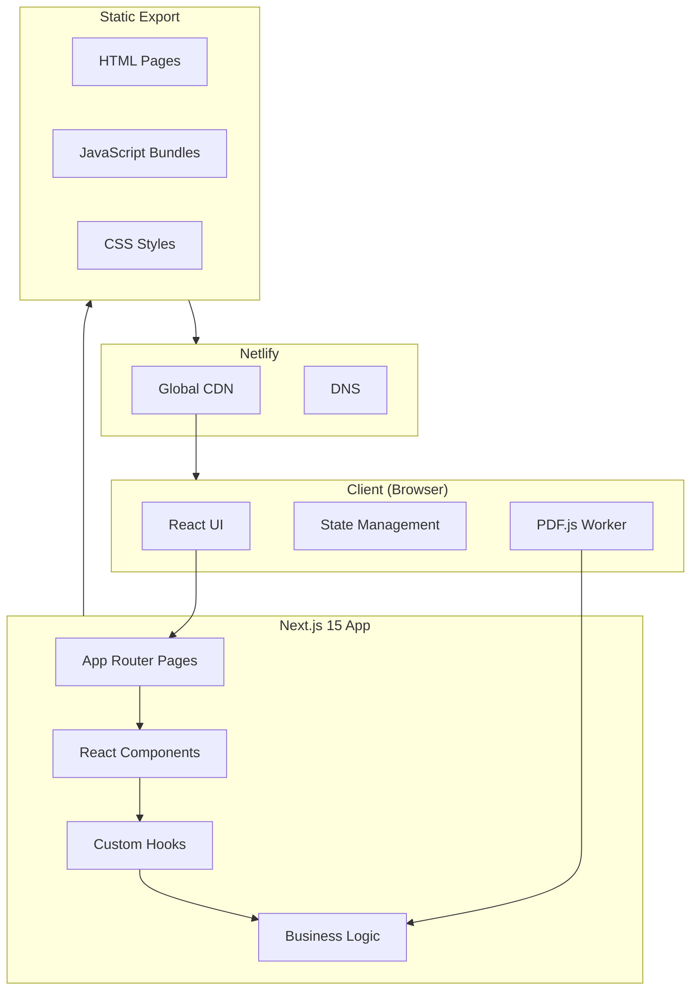
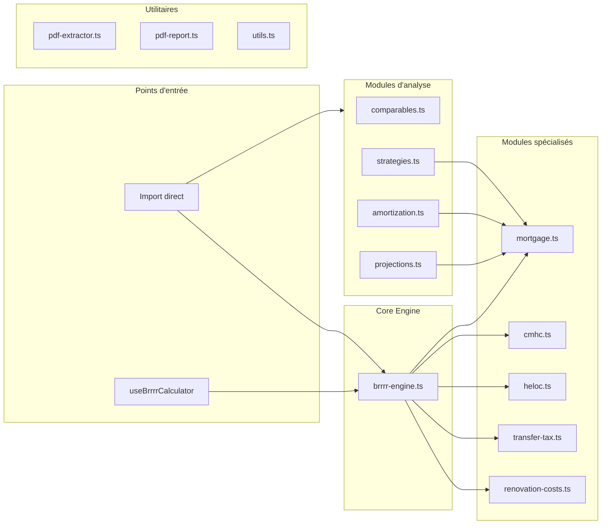
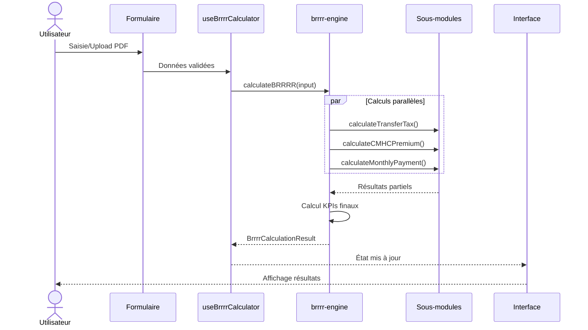
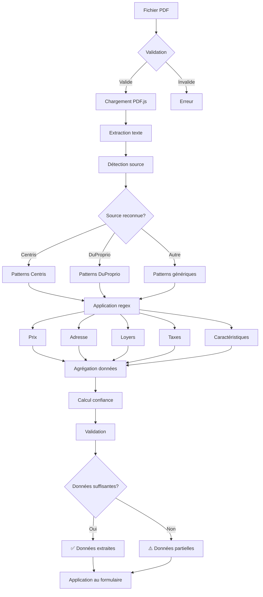
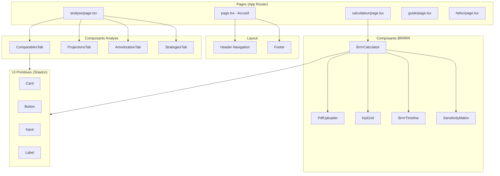
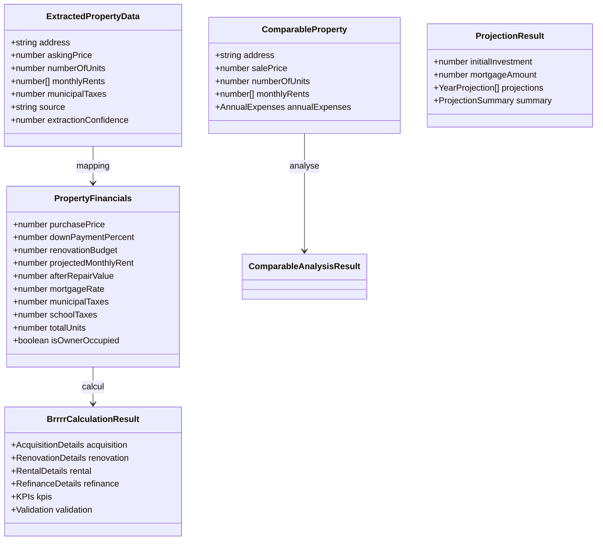
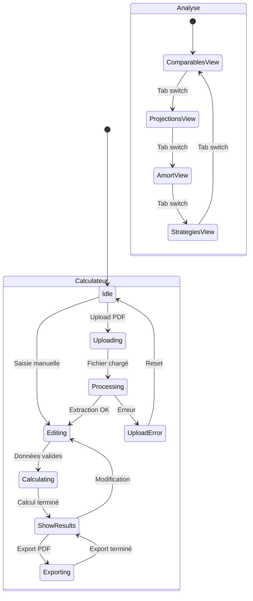
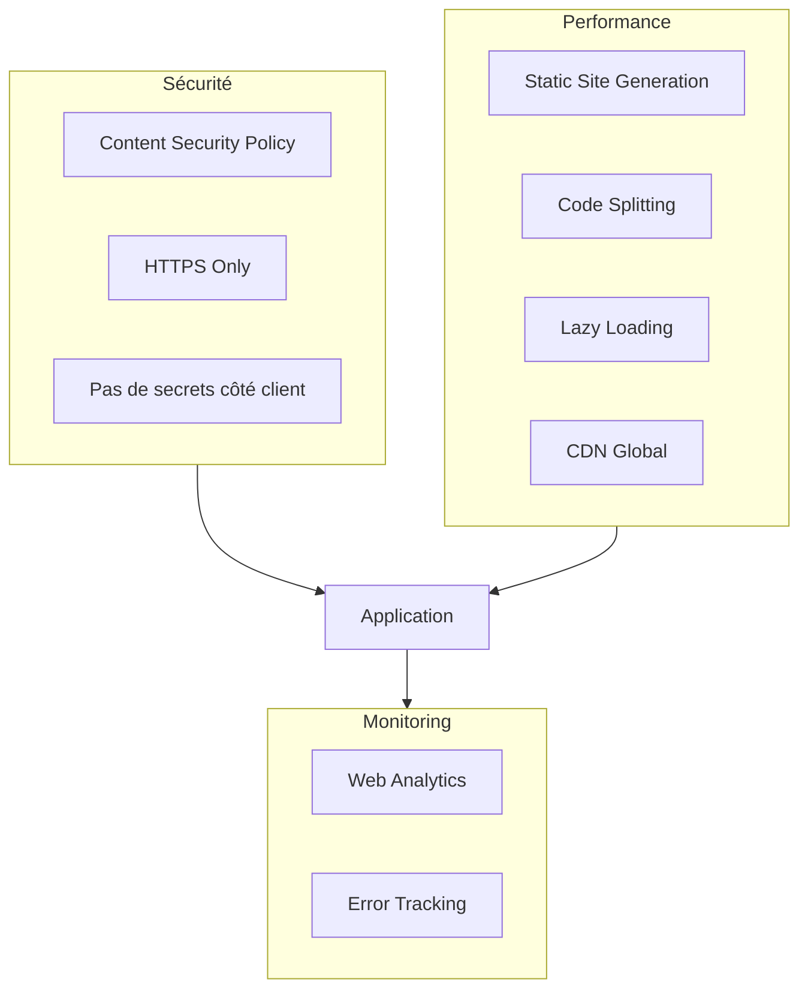
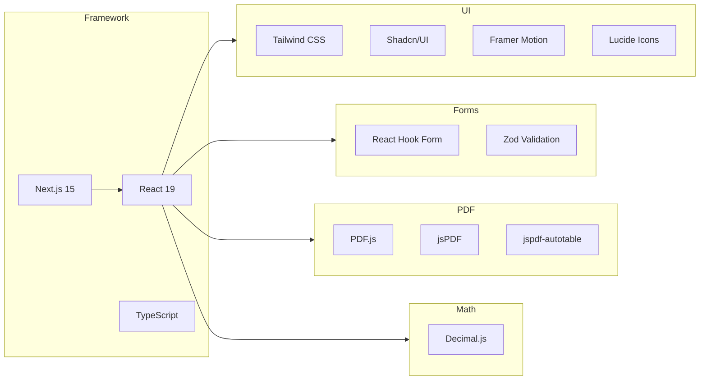

# PlexInvest Québec - Architecture Technique

## Vue d'ensemble de l'architecture



## Architecture des modules de calcul



## Flux de données - Calculateur BRRRR



## Flux d'extraction PDF



## Architecture des composants React



## Diagramme de classes - Types principaux



## État de l'application



## Pipeline de build et déploiement

```mermaid
flowchart LR
    subgraph Dev["Développement"]
        Code[Code Source]
        Git[Git Commit]
    end

    subgraph CI["Intégration Continue"]
        Push[Git Push]
        Netlify[Netlify Build]
    end

    subgraph Build["Build Next.js"]
        TS[TypeScript Check]
        Lint[ESLint]
        Compile[Compilation]
        Static[Export Statique]
    end

    subgraph Deploy["Déploiement"]
        Upload[Upload CDN]
        Invalidate[Cache Invalidation]
        Live[Site Live]
    end

    Code --> Git --> Push
    Push --> Netlify
    Netlify --> TS --> Lint --> Compile --> Static
    Static --> Upload --> Invalidate --> Live
```



## Sécurité et performance



## Dépendances principales



---

## Conventions de code

### Structure des fichiers

```
src/lib/calculations/
├── index.ts           # Exports publics
├── mortgage.ts        # Calculs hypothécaires
├── cmhc.ts           # Primes SCHL
├── heloc.ts          # Financement HELOC
├── transfer-tax.ts   # Droits de mutation
├── brrrr-engine.ts   # Moteur principal
├── comparables.ts    # Analyse comparative
├── projections.ts    # Projections 5 ans
├── amortization.ts   # Table d'amortissement
└── strategies.ts     # Stratégies d'optimisation
```

### Naming conventions

| Type | Convention | Exemple |
|------|------------|---------|
| Fichiers | kebab-case | `brrrr-engine.ts` |
| Composants | PascalCase | `BrrrrCalculator.tsx` |
| Hooks | camelCase avec use | `useBrrrrCalculator` |
| Types | PascalCase | `PropertyFinancials` |
| Constantes | SCREAMING_SNAKE | `BSIF_RULES` |
| Fonctions | camelCase | `calculateBRRRR` |

---

*Architecture PlexInvest Québec v1.0*
