# PlexInvest Québec - Documentation Fonctionnelle

## Table des matières

1. [Vue d'ensemble](#vue-densemble)
2. [Architecture technique](#architecture-technique)
3. [Modules fonctionnels](#modules-fonctionnels)
4. [Flux de données](#flux-de-données)
5. [Règles métier](#règles-métier)
6. [API et calculs](#api-et-calculs)
7. [Interface utilisateur](#interface-utilisateur)
8. [Déploiement](#déploiement)

---

## Vue d'ensemble

### Description

PlexInvest Québec est une plateforme SaaS d'analyse immobilière spécialisée dans les stratégies **BRRRR** (Buy, Rehab, Rent, Refinance, Repeat) et **HELOC** pour le marché québécois.

### Objectifs

- Fournir un calculateur BRRRR précis avec les règles BSIF canadiennes
- Supporter l'upload de fiches PDF (Centris, DuProprio) avec extraction automatique
- Offrir des outils d'analyse comparative et de projections financières
- Respecter les spécificités du marché québécois (taxes, SCHL, taux canadiens)

### Public cible

- Investisseurs immobiliers au Québec
- Courtiers immobiliers
- Conseillers financiers spécialisés en immobilier

---

## Architecture technique

### Stack technologique

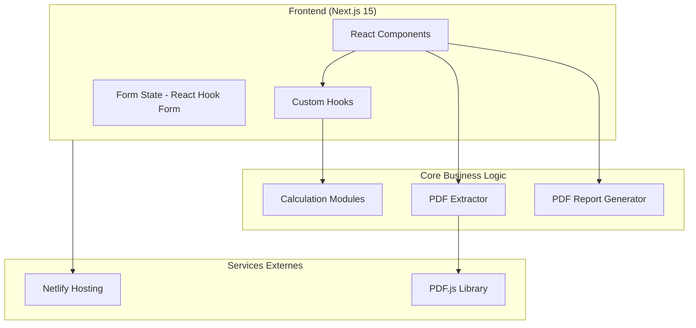

### Structure des dossiers

```
plexinvest-quebec/
├── src/
│   ├── app/                    # Pages Next.js (App Router)
│   │   ├── page.tsx           # Page d'accueil
│   │   ├── calculateur/       # Calculateur BRRRR
│   │   ├── analyse/           # Outils d'analyse avancée
│   │   ├── heloc/             # Calculateur HELOC
│   │   └── guide/             # Guide éducatif
│   ├── components/
│   │   ├── brrrr/             # Composants BRRRR
│   │   └── ui/                # Composants UI (Shadcn)
│   ├── hooks/                 # Custom React hooks
│   ├── lib/
│   │   ├── calculations/      # Modules de calcul
│   │   ├── pdf-extractor.ts   # Extraction PDF
│   │   └── pdf-report.ts      # Génération rapports
│   └── types/                 # Types TypeScript
├── docs/                      # Documentation
└── public/                    # Assets statiques
```

### Diagramme de composants

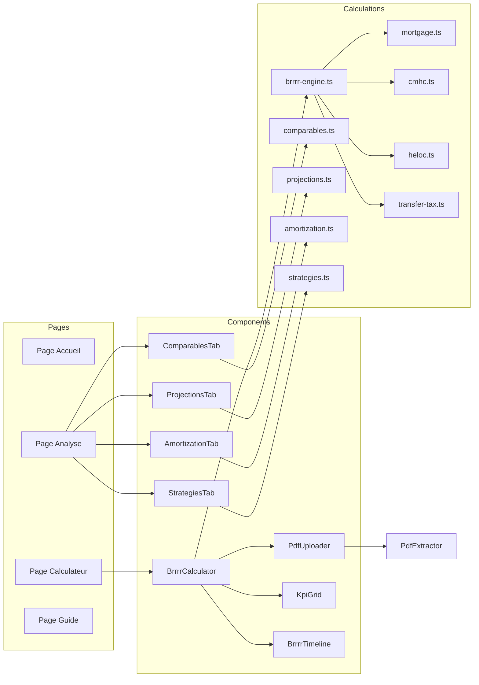

---

## Modules fonctionnels

### 1. Calculateur BRRRR

#### Description
Le module principal permettant d'analyser un projet immobilier selon la stratégie BRRRR.

#### Fonctionnalités
- Saisie des paramètres d'acquisition, rénovation, location, refinancement
- Upload de fiche PDF avec extraction automatique
- Calcul en temps réel des KPIs
- Génération de rapport PDF

#### Diagramme de séquence - Calcul BRRRR

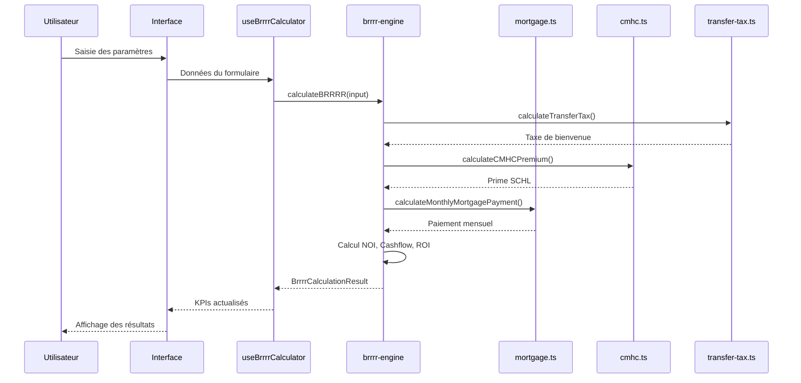

### 2. Extracteur PDF

#### Description
Module permettant d'extraire automatiquement les données d'une fiche immobilière PDF.

#### Sources supportées
- Centris
- DuProprio
- RE/MAX
- Royal LePage
- Autres (extraction générique)

#### Diagramme de flux - Extraction PDF

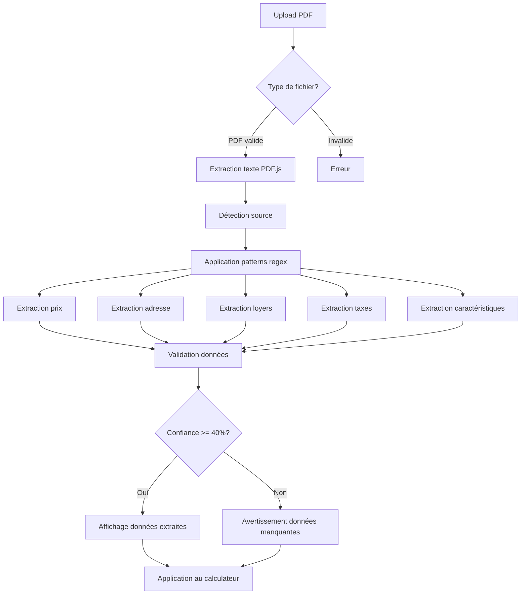

#### Données extraites

| Champ | Pattern de reconnaissance | Obligatoire |
|-------|--------------------------|-------------|
| Prix demandé | `prix demandé`, `$XXX,XXX` | Oui |
| Adresse | `rue`, `avenue`, `boulevard` + numéro | Oui |
| Code postal | `A1A 1A1` | Non |
| Nombre de logements | `duplex`, `triplex`, `X logements` | Oui |
| Loyers | `loyer`, `$/mois` | Oui |
| Taxes municipales | `taxes municipales`, `taxe foncière` | Oui |
| Taxes scolaires | `taxes scolaires` | Non |
| Année de construction | `construit en`, `année construction` | Non |

### 3. Analyse des Comparables

#### Description
Outil d'analyse comparative permettant de valider le prix d'une propriété par rapport à des comparables.

#### Multiplicateurs calculés

- **MRB** (Multiplicateur de Revenus Brut) = Prix / Revenus Annuels Bruts
- **MRN** (Multiplicateur de Revenus Nets) = Prix / NOI
- **PPP** (Prix Par Porte) = Prix / Nombre de logements

#### Diagramme de calcul

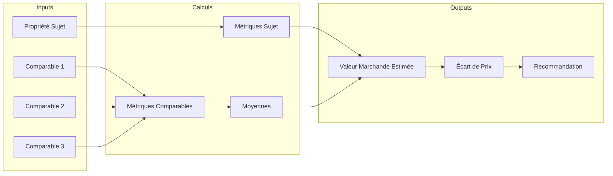

### 4. Projections 5 ans

#### Description
Module de projection financière sur 5 ans avec croissance des revenus et appréciation.

#### Paramètres de projection

- Croissance des loyers (% annuel)
- Croissance des dépenses (% annuel)
- Appréciation de la propriété (% annuel)
- Taux hypothécaire

#### Métriques calculées par année

- Revenus annuels
- Dépenses annuelles
- Cashflow
- Cash-on-Cash Return
- Valeur de la propriété
- Équité
- Rendement total (Cash + Remboursement dette + Appréciation)

### 5. Table d'Amortissement

#### Description
Génération de table d'amortissement détaillée avec calculs canadiens (composition semi-annuelle).

#### Fonctionnalités

- Table mensuelle complète
- Résumé annuel
- Comparaison 25 ans vs 30 ans
- Simulation de paiements accélérés

### 6. Stratégies d'optimisation

#### Stratégie Cash Back

Analyse de l'opportunité d'accepter un taux plus élevé en échange d'une remise en argent.

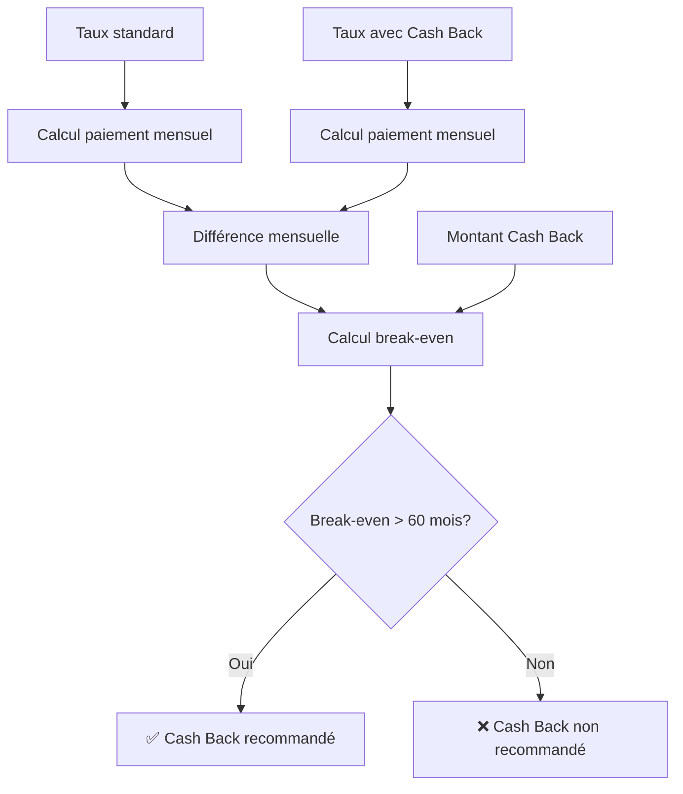

#### Stratégie Intérêts Seulement

Analyse du boost de cashflow en payant seulement les intérêts pendant la période de rénovation.

#### Stratégie Paiements Accélérés

Comparaison des options de remboursement:
- Standard (mensuel)
- Bi-hebdomadaire
- Avec paiements additionnels

---

## Flux de données

### Flux principal - Analyse BRRRR

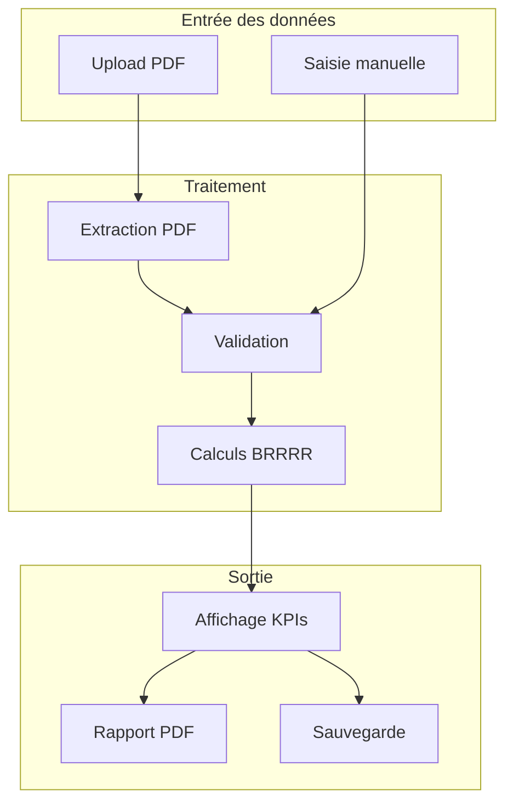

### État de l'application

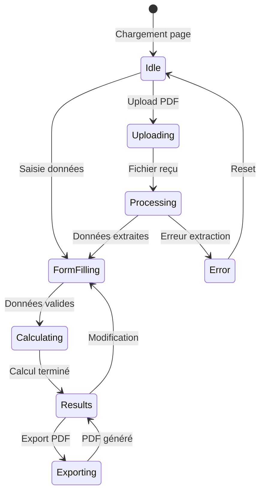

---

## Règles métier

### Règles BSIF (Bureau du surintendant des institutions financières)

| Règle | Valeur | Description |
|-------|--------|-------------|
| LTV Max HELOC Rotatif | 65% | Portion qui peut être retirée et réutilisée |
| LTV Max Refinancement | 80% | Maximum finançable sur valeur marchande |
| Stress Test Buffer | +2% | Ajouté au taux contractuel |
| Stress Test Floor | 5.25% | Taux minimum pour qualification |
| DCR Minimum Commercial | 1.25x | Pour propriétés 5+ logements |

### Calculs hypothécaires canadiens

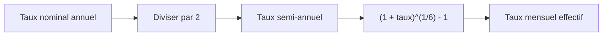

**Formule:** `taux_mensuel = (1 + taux_annuel/2)^(1/6) - 1`

### Taxe de bienvenue (Droits de mutation)

#### Tranches standard

| Tranche | Taux |
|---------|------|
| 0$ - 55 200$ | 0.5% |
| 55 200$ - 276 200$ | 1.0% |
| 276 200$ - 500 000$ | 1.5% |
| 500 000$ + | 2.0% |

#### Surtaxe Montréal

Pour les propriétés > 500 000$:
- 500 000$ - 1 000 000$: 2.5%
- 1 000 000$+: 3.0%

### Primes SCHL

| Mise de fonds | Prime |
|---------------|-------|
| 5% - 9.99% | 4.00% |
| 10% - 14.99% | 3.10% |
| 15% - 19.99% | 2.80% |
| 20%+ | 0% (pas requis) |

---

## API et calculs

### Principales fonctions

#### `calculateBRRRR(input: PropertyFinancials): BrrrrCalculationResult`

Calcul complet de la stratégie BRRRR.

**Entrée:**
```typescript
interface PropertyFinancials {
  purchasePrice: number
  downPaymentPercent: number
  renovationBudget: number
  projectedMonthlyRent: number
  afterRepairValue: number
  mortgageRate: number
  // ...
}
```

**Sortie:**
```typescript
interface BrrrrCalculationResult {
  acquisition: AcquisitionDetails
  renovation: RenovationDetails
  rental: RentalDetails
  refinance: RefinanceDetails
  kpis: {
    cashOnCashReturn: number
    monthlyCashflow: number
    capRate: number
    isInfiniteReturn: boolean
    // ...
  }
  validation: {
    isValid: boolean
    warnings: string[]
    errors: string[]
  }
}
```

#### `extractPropertyDataFromPdf(file: File): Promise<ExtractedPropertyData>`

Extraction des données d'un PDF immobilier.

#### `calculateProjections(params: ProjectionParams): ProjectionResult`

Projections financières sur 5 ans.

#### `analyzeWithComparables(subject, comparables): ComparableAnalysisResult`

Analyse comparative avec calcul de valeur marchande.

---

## Interface utilisateur

### Pages principales

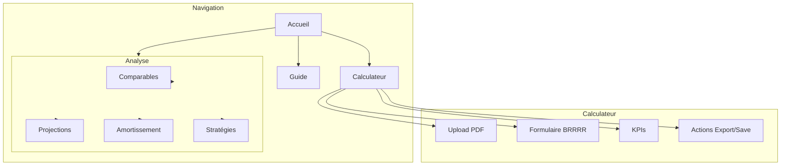

### Composants UI

| Composant | Description |
|-----------|-------------|
| `PdfUploader` | Zone de drag & drop pour upload PDF |
| `BrrrrCalculator` | Formulaire complet avec sections collapsibles |
| `KpiGrid` | Grille de KPIs avec code couleur |
| `BrrrrTimeline` | Visualisation des 4 phases BRRRR |
| `SensitivityMatrix` | Matrice de sensibilité (prix/taux) |

### Code couleur des KPIs

| Condition | Couleur | Signification |
|-----------|---------|---------------|
| Cash-on-Cash >= 10% | Vert | Excellent rendement |
| Cash-on-Cash 5-10% | Jaune | Rendement correct |
| Cash-on-Cash < 5% | Rouge | Rendement faible |
| Cashflow positif | Vert | Propriété rentable |
| Cashflow négatif | Rouge | Propriété déficitaire |
| Rendement infini | Bleu | Tout le capital récupéré |

---

## Déploiement

### Architecture de déploiement

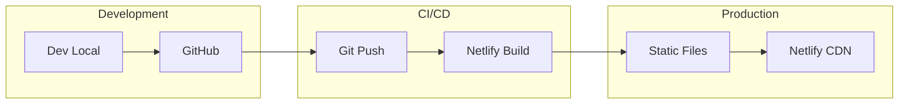

### Configuration Netlify

```toml
[build]
  command = "npm run build"
  publish = "out"

[build.environment]
  NODE_VERSION = "20"

[[redirects]]
  from = "/*"
  to = "/index.html"
  status = 200
```

### URLs de production

- **Site:** https://plexinvest-brrrr.netlify.app
- **Repository:** https://github.com/kakame94/heloc

---

## Évolutions futures

1. **Base de données** - Persistance des analyses et portefeuille
2. **Authentification** - Comptes utilisateurs
3. **API backend** - Intégration avec services externes
4. **Mobile** - Application React Native
5. **IA** - Amélioration de l'extraction PDF avec ML

---

*Document généré automatiquement - PlexInvest Québec v1.0*
